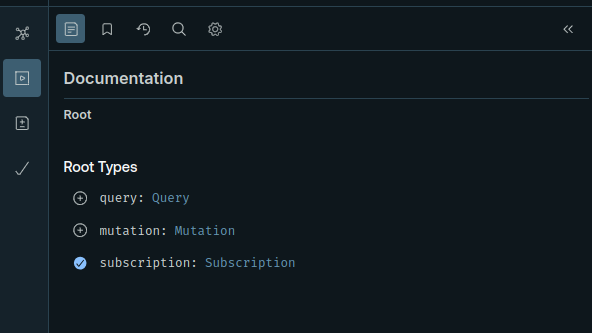
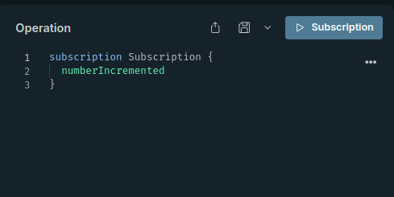
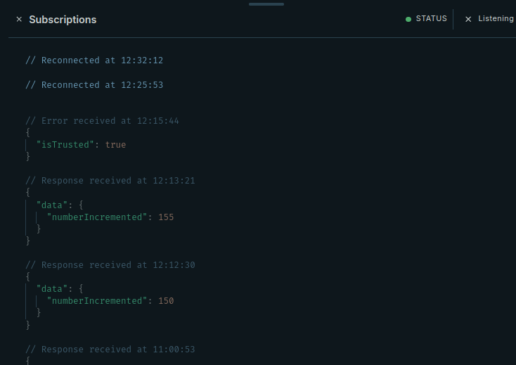
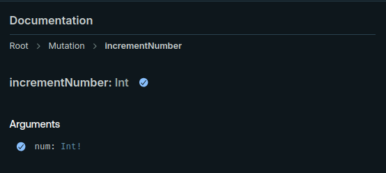
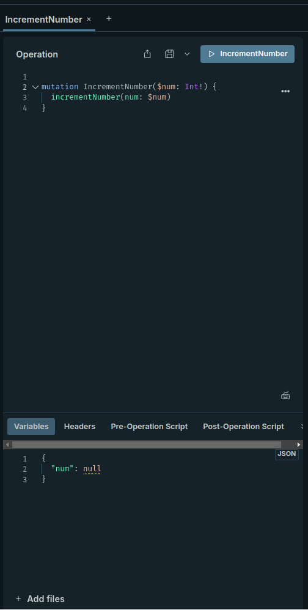

# Graphql examplar

This examplar creates a Apollo subscription server, graphql websockets, and react application. There are two queries that interact with the Apollo subscription:

```
subscription Subscription {
  numberIncremented
}
```

```
mutation IncrementNumber($num: Int!) {
  incrementNumber(num: $num)
}
```

# How to run

## Start Apollo server

- Go to the server file
- Run `pnpm start`

## Open GraphQL sandbox

- In a browser go to `http://localhost:4000/graphql`

## Connect to the Subscription query

- Select the subscription query from the documentation section



- Confirm the subscription is in the operation section and click the `Subscription` button



- The sandbox will connect to the subscription query and shown in the subscription section



## Publish and listen to updates

- Select the `IncrementNumber` mutation and the `num` argument in the documentation section



- The mutation and argument will appear in the operation section, edit the `num` variable with any number, and click the `incrementNumber` button



- In the subscription section, you will see the update value published from the mutation

## Run the client

- Open another terminal, go to the client folder, and run `pnpm start`
- The inital screen will show `Subscription connected`
- After running the above mutation it will display the published value
